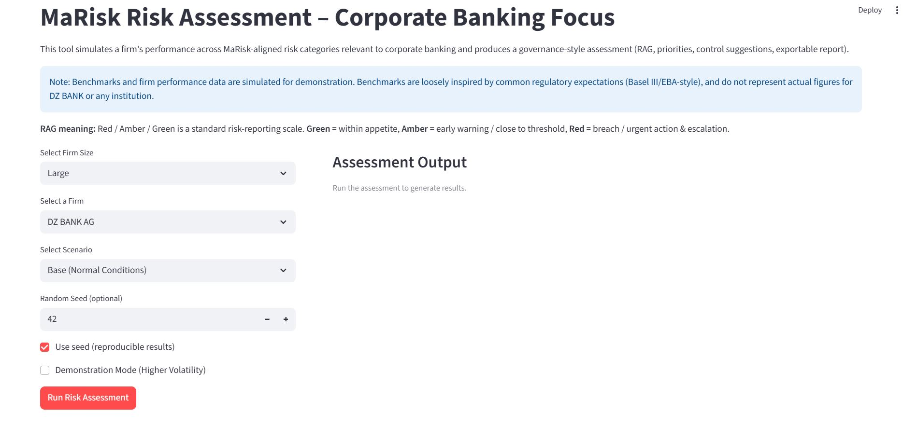
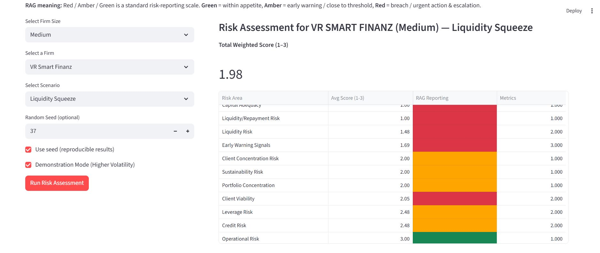
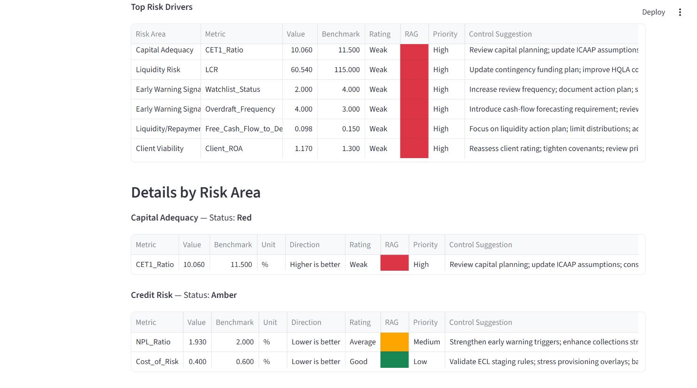
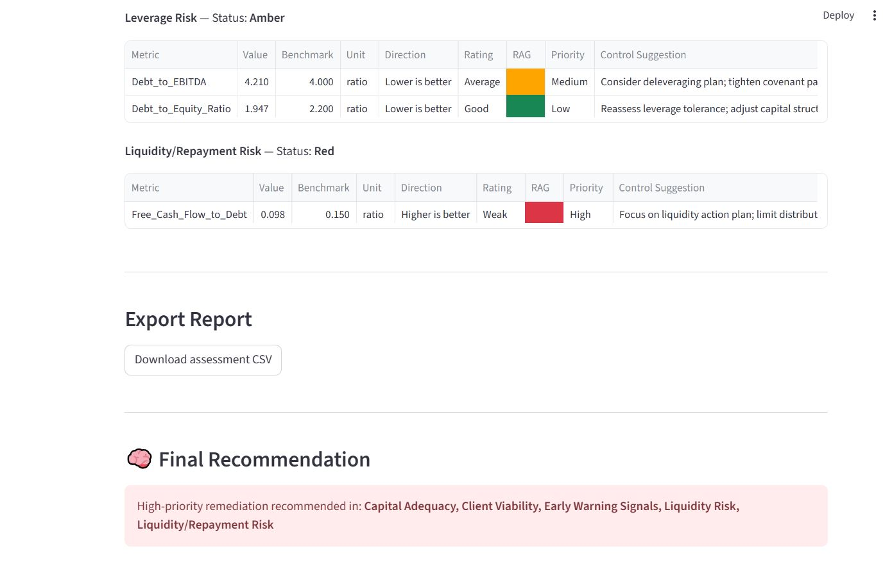
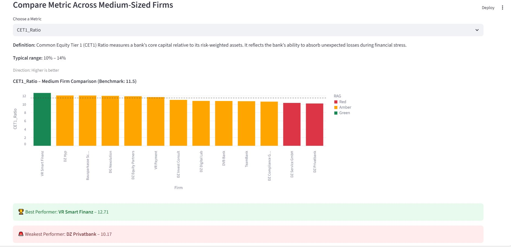

# MaRisk Risk Assessment Simulator (Corporate Banking Focus)

Streamlit-based application that simulates a **MaRisk-inspired governance-style risk assessment** for corporate banking portfolios.

The tool evaluates capital, liquidity, credit, market, operational, concentration and client-related metrics under different stress scenarios and generates:

- RAG status (Red / Amber / Green)
- Weighted total risk score (1–3)
- Top risk drivers
- Governance-style control recommendations
- Scenario comparison outputs
- Exportable CSV assessment report

---

## Project Motivation

This project was developed to demonstrate how quantitative risk metrics can be translated into structured governance reporting aligned with supervisory expectations (e.g., MaRisk / Basel-style frameworks).

It focuses on:
- Explainable scoring logic
- Scenario-based stress simulation
- Risk prioritization
- Clear reporting structure

> Disclaimer: All benchmarks and results are simulated for demonstration purposes only and do not represent any real institution.

---

## Why This Project Matters

In corporate banking, risk metrics are often computed quantitatively but reported qualitatively to senior management.

This project demonstrates how:

- Quantitative indicators can be translated into structured governance reporting
- Scenario analysis can support supervisory dialogue
- Risk prioritization can be made transparent and explainable
- Technical implementation (Python / Streamlit) can support regulatory-style frameworks

The focus is not mainly on prediction accuracy, but on explainability, governance alignment, and decision-support logic.

---

## How Scoring Works

Each metric is compared against a size-specific benchmark.

Depending on tolerance bands:

- **Good** -> Score 3 -> Green  
- **Average** -> Score 2 -> Amber  
- **Weak** -> Score 1 -> Red  

The overall score is a weighted average of metric scores.

---

## Run Locally

```bash
pip install -r requirements.txt
streamlit run app.py
```
---

## Application Preview

### Initial Interface


### Dashboard Overview


### Detailed Risk Area View


### Detailed Risk Area View + Governance Recommendation Output


### Metric Comparison

